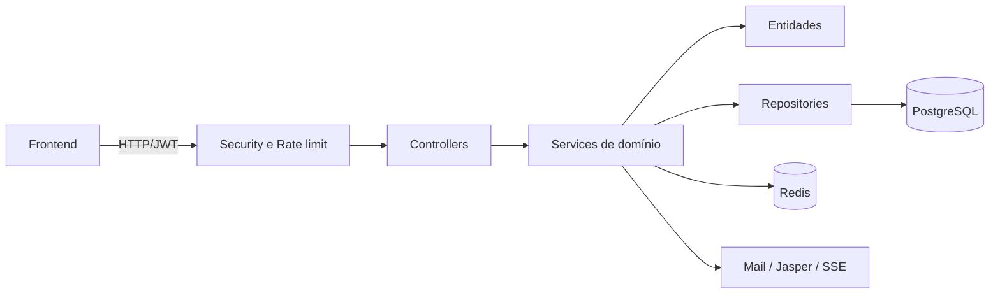
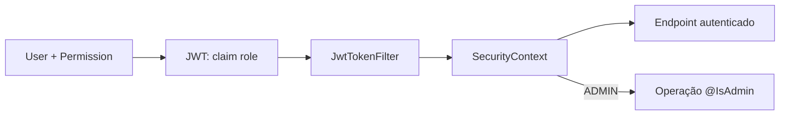

# Caraíva Tours Hub — backend

Backend de uma plataforma para centralizar a operação de uma agência de passeios: catálogo, reservas, clientes, pagamentos, cancelamentos, usuários e indicadores.

## Contexto

O projeto foi inspirado em um problema real. Registros de passeios, reservas, comprovantes e pagamentos eram administrados em conversas no WhatsApp. Embora útil para atendimento, o WhatsApp não funciona bem como sistema de gestão: a informação fica espalhada, cálculos dependem de trabalho manual, o histórico é difícil de auditar e a operação depende da conversa de cada atendente.

O Caraíva Tours Hub transforma esse fluxo em dados estruturados. Ele reúne a operação em uma única fonte, relaciona vendas aos responsáveis, preserva os valores negociados, registra mudanças importantes e fornece visões operacionais e financeiras.

## Principais capacidades

- autenticação e autorização de administradores e funcionários;
- gestão de usuários, categorias e passeios;
- reservas com cliente, participantes, embarque, agenda e desconto;
- pagamentos de sinal e comprovantes;
- histórico de status e fluxo de cancelamento/reembolso;
- dashboards operacionais e financeiros com atualização via SSE;
- geração de relatórios PDF;
- cache e rate limiting distribuídos com Redis.

## Tecnologias

| Área | Tecnologias |
| --- | --- |
| Plataforma | Java 21 e Spring Boot 4 |
| API | Spring MVC, Bean Validation e SSE |
| Persistência | Spring Data JPA, Hibernate, PostgreSQL e Flyway |
| Segurança | Spring Security, JWT e Argon2 |
| Infraestrutura | Redis, Spring Cache, Lettuce e Bucket4j |
| Apoio | MapStruct, Lombok, JasperReports e Spring Mail |
| Documentação e testes | OpenAPI/Swagger, JUnit e Testcontainers |

As versões exatas estão no [`pom.xml`](pom.xml).

## Arquitetura

O código usa organização **por domínio (package by feature)**. Cada domínio reúne suas entidades, serviços, repositórios, DTOs, mappers e controllers. Regras que pertencem ao objeto ficam nas entidades; coordenação de casos de uso, transações e integrações fica nos services.



```text
src/main/java/com/caraivatours/hub/
├── auth/                         # autenticação, JWT e recuperação de senha
├── booking/                      # agregado central de reservas e histórico
├── category/ e tour/             # catálogo de passeios
├── client/, groupmember/         # cliente e participantes
├── pickuplocation/               # embarque e taxa aplicada
├── payment/ e refundrequest/     # financeiro e cancelamentos
├── dashboard/                    # indicadores REST e eventos SSE
├── user/                         # contas, perfis e papéis
├── jasper/, mail/, ratelimit/    # módulos transversais
└── shared/                       # configurações, erros e componentes comuns
```

## Segurança e RBAC

A API é stateless e utiliza JWT. A autorização segue **RBAC (Role-Based Access Control)**:

| Papel | Escopo geral |
| --- | --- |
| `EMPLOYEE` | operação cotidiana e recursos relacionados às próprias reservas |
| `ADMIN` | gestão, consultas globais, financeiro e decisões administrativas |

O papel persistido em `Permission` é incluído no JWT e convertido em `GrantedAuthority`. `SecurityConfig` exige autenticação em `/api/**`; `@EnableMethodSecurity` e `@IsAdmin` restringem operações administrativas. Serviços também validam propriedade do recurso quando RBAC sozinho não é suficiente.



Detalhes de emissão, rotação, revogação e recuperação de senha estão nas documentações do domínio `auth`.

## Documentação por domínio

Cada README abaixo descreve as regras de negócio, responsabilidades dos services, comportamento das entidades e fluxos específicos:

| Domínio | Documentação |
| --- | --- |
| Autenticação | [`auth`](src/main/java/com/caraivatours/hub/auth/README.md) |
| JWT e refresh token | [`auth/jwt`](src/main/java/com/caraivatours/hub/auth/jwt/README.md) |
| Recuperação de senha | [`auth/passwordreset`](src/main/java/com/caraivatours/hub/auth/passwordreset/README.md) |
| Reservas | [`booking`](src/main/java/com/caraivatours/hub/booking/README.md) |
| Categorias | [`category`](src/main/java/com/caraivatours/hub/category/README.md) |
| Passeios | [`tour`](src/main/java/com/caraivatours/hub/tour/README.md) |
| Clientes | [`client`](src/main/java/com/caraivatours/hub/client/README.md) |
| Participantes | [`groupmember`](src/main/java/com/caraivatours/hub/groupmember/README.md) |
| Embarque | [`pickuplocation`](src/main/java/com/caraivatours/hub/pickuplocation/README.md) |
| Pagamentos | [`payment`](src/main/java/com/caraivatours/hub/payment/README.md) |
| Reembolsos | [`refundrequest`](src/main/java/com/caraivatours/hub/refundrequest/README.md) |
| Usuários | [`user`](src/main/java/com/caraivatours/hub/user/README.md) |
| Dashboard e SSE | [`dashboard`](src/main/java/com/caraivatours/hub/dashboard/README.md) |
| Rate limiting | [`ratelimit`](src/main/java/com/caraivatours/hub/ratelimit/README.md) |
| E-mail | [`mail`](src/main/java/com/caraivatours/hub/mail/README.md) |
| Relatórios | [`jasper`](src/main/java/com/caraivatours/hub/jasper/README.md) |
| Configurações e recursos comuns | [`shared`](src/main/java/com/caraivatours/hub/shared/README.md) |

## Execução local

Pré-requisitos: JDK 21, PostgreSQL e Redis.

### Configuração inicial

Antes de iniciar o sistema pela primeira vez, crie um arquivo `.env` na raiz do repositório, no mesmo diretório do `docker-compose.yml`. Esse arquivo não deve ser versionado, pois contém credenciais e outros dados sensíveis.

```dotenv
DB_URL=jdbc:postgresql://localhost:5432/caraiva_tours_hub
DB_USERNAME=postgres
DB_PASSWORD=troque-por-uma-senha-segura

SPRING_DATA_REDIS_HOST=localhost
SPRING_DATA_REDIS_PORT=6379

JWT_SECRET_KEY=troque-por-uma-chave-longa-e-aleatoria

EMAIL_USERNAME=seu-email@gmail.com
EMAIL_PASSWORD=senha-de-aplicativo-do-provedor

BOOTSTRAP_ADMIN_ENABLED=true
BOOTSTRAP_ADMIN_USERNAME=administrador
BOOTSTRAP_ADMIN_FULL_NAME=Administrador do Sistema
BOOTSTRAP_ADMIN_EMAIL=admin@empresa.com
```

Quando a aplicação iniciar com `BOOTSTRAP_ADMIN_ENABLED=true`, ela criará o administrador inicial caso ainda não exista um usuário com essa permissão. O processo é idempotente: reiniciar a aplicação não cria administradores duplicados.

O administrador criado pelo bootstrap não possui uma senha conhecida. Após iniciar o backend e o frontend:

1. acesse a tela de login;
2. selecione **Esqueci minha senha**;
3. informe exatamente o e-mail definido em `BOOTSTRAP_ADMIN_EMAIL`;
4. abra o link recebido por e-mail e defina a senha inicial;
5. retorne à tela de login e acesse o sistema como administrador.

O link de redefinição é temporário, de uso único, e depende do Redis e do serviço SMTP estarem disponíveis. Depois de confirmar o primeiro acesso, recomenda-se alterar `BOOTSTRAP_ADMIN_ENABLED` para `false` no ambiente de produção.

### Inicialização

```bash
./mvnw spring-boot:run
```

No perfil de desenvolvimento, a API usa a porta `8080`, executa migrações Flyway e disponibiliza o Swagger UI em `/swagger-ui/index.html`.

```bash
./mvnw test
```

Os testes de integração utilizam Testcontainers e, portanto, podem exigir Docker disponível.
