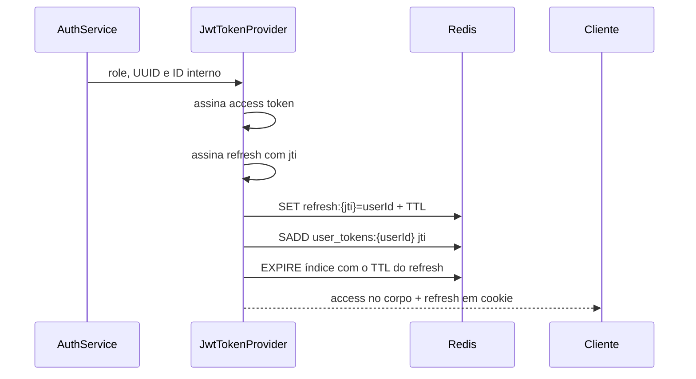
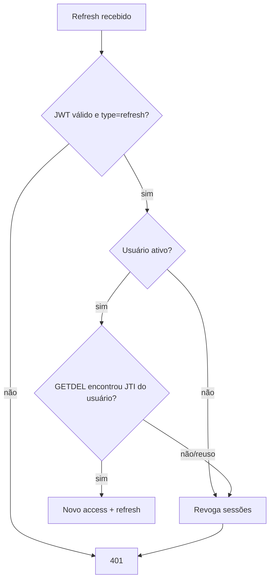

# JWT e ciclo de sessão

Esta pasta implementa access tokens, refresh tokens e a criação do principal autenticado usado pelo Spring Security.

## Componentes

- `JwtTokenProvider`: assina, verifica e interpreta JWTs;
- `JwtTokenFilter`: lê `Authorization: Bearer`, valida o access token e preenche o `SecurityContext`;
- `RefreshTokenStore`: registra, consome e revoga JTIs no Redis.

## Tipos de token

| Tipo | Uso | Estado no servidor |
| --- | --- | --- |
| Access | autenticar chamadas a `/api/**` | nenhum; assinatura e expiração bastam |
| Refresh | obter um novo par de tokens | JTI obrigatório no Redis |

Os tokens carregam `sub` com o UUID público, `userId`, `role` e `type`. O access também informa o emissor. O claim `type` impede que um refresh válido seja utilizado como Bearer.

## Emissão

`createAccessToken` cria os dois tokens a partir do mesmo instante. O access expira segundo `app.security.jwt.token.expire-length`; o refresh dura três vezes esse período. Cada refresh recebe um `jti` aleatório, salvo como `refresh:{jti}` com TTL igual à expiração.



## Rotação do refresh

`createRefreshToken` executa, nesta ordem:

1. rejeita token ausente;
2. verifica assinatura e expiração;
3. exige `type=refresh`;
4. consulta o PostgreSQL para confirmar que a conta continua ativa;
5. consome atomicamente o JTI no Redis;
6. emite um novo par.

`RefreshTokenStore.consume` usa `GETDEL`. Ler e apagar numa única operação garante que duas requisições concorrentes não renovem a mesma sessão. Após consumo, o JTI também é retirado do conjunto do usuário.



## Detecção de reutilização e revogação

Se o JTI já não existir ou pertencer a outro usuário, o código trata o caso como possível replay. `revokeAllForUser` percorre `user_tokens:{userId}`, apaga todos os `refresh:{jti}` e remove o conjunto. O resultado é logout forçado de todas as sessões registradas daquele usuário.

Redis é necessário porque JWT, isoladamente, não oferece uso único nem revogação antes da expiração.

## Higiene de memória do índice por usuário

O índice `user_tokens:{userId}` é um **Set**:

```text
user_tokens:{userId}
  member = jti
```

Cada salvamento adiciona o JTI com `SADD` e aplica ao conjunto o mesmo TTL do refresh recém-emitido. Como tokens novos possuem a mesma duração e são emitidos depois dos anteriores, o TTL é renovado até a expiração da sessão mais recente. Assim, o índice desaparece automaticamente quando o usuário fica sem novas sessões, mesmo que os tokens não sejam consumidos nem revogados explicitamente.

Um JTI consumido é removido do Set. Referências a tokens que expiraram antes da chave do índice podem permanecer temporariamente no conjunto, mas deixam de ocupar memória quando o TTL do próprio `user_tokens:{userId}` termina. Na revogação, o conjunto permite localizar e apagar todas as chaves `refresh:{jti}` ainda existentes.

## Autenticação de requests

`resolveToken` só aceita o prefixo `Bearer `. `getAuthenticationFromToken` exige `type=access`, converte a role em `SimpleGrantedAuthority` e cria um `AuthenticatedUser` com UUID, ID interno, papel e expiração. O filtro coloca essa autenticação no contexto para controllers, `@IsAdmin` e regras de propriedade.

## Chaves Redis

| Chave | Valor | Ciclo de vida |
| --- | --- | --- |
| `refresh:{jti}` | ID interno do usuário | TTL do refresh ou primeiro consumo |
| `user_tokens:{userId}` | Set de JTIs do usuário | consumo, revogação ou TTL renovado a cada emissão |
