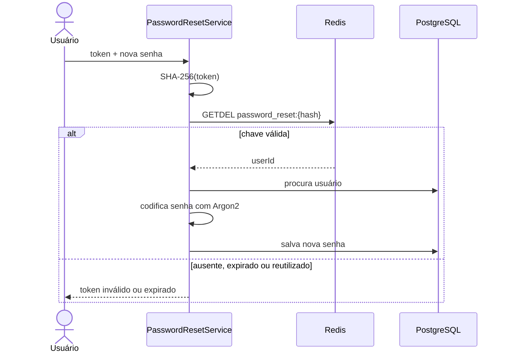

# Definição e recuperação de senha

`PasswordResetService` atende dois casos com a mesma credencial descartável:

- primeiro acesso de uma conta criada por administrador;
- recuperação solicitada em “esqueci minha senha”.

## Emissão do token

`processResetRequest` e `processInitialPasswordSetup` chamam `issueToken`, alterando somente o modelo do e-mail. Se o endereço não existir, o método termina silenciosamente para impedir enumeração de contas.

Para um usuário existente:

1. gera 32 bytes com `SecureRandom`;
2. codifica o token em Base64 URL-safe, sem padding;
3. calcula SHA-256 do token;
4. salva `password_reset:{hash}` no Redis com o ID do usuário e TTL de 15 minutos;
5. envia somente o token original no link por e-mail.

O Redis não armazena o segredo enviado ao usuário. Se suas chaves forem lidas, o hash não permite usar diretamente o link de redefinição.

## Consumo

O `GETDEL` ocorre antes da alteração da senha e torna o token de uso único mesmo quando duas requisições chegam juntas. Usuário removido e token inválido produzem a mesma resposta, evitando exposição de estado interno.

## Primeiro acesso

Ao criar uma conta, `UserService` grava primeiro uma credencial aleatória e desconhecida. Só depois dispara `processInitialPasswordSetup`. Dessa forma não existe senha padrão compartilhada; o próprio usuário define a primeira senha pelo fluxo temporário.

## Responsabilidades relacionadas

- `PasswordResetService`: segurança e ciclo de vida do token;
- `EmailService`: conteúdo e entrega da mensagem;
- `PasswordEncoder`: codificação Argon2 da nova senha;
- `UserRepository`: fonte permanente da conta;
- Redis: estado efêmero de 15 minutos.
