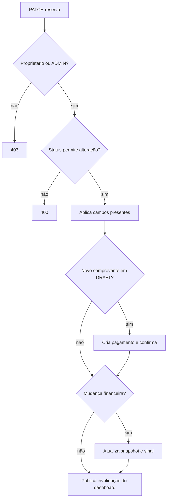

# Domínio de reservas

`booking` é o agregado central da aplicação. Uma reserva conecta atendente, cliente, passeio, local de embarque, participantes, pagamento e histórico, preservando os valores negociados no momento da operação.

## Estrutura

```text
booking/
├── controller/ e dto/       # API e contratos
├── embeddable/               # FinancialSnapshot
├── enums/                    # BookingStatus
├── event/                    # eventos de mudança de status
├── statushistory/            # auditoria das transições
├── Booking.java              # raiz do agregado e regras próprias
├── BookingService.java       # casos de uso e transações
├── BookingRepository.java    # persistência e projeções
└── BookingMapper.java
```

## Modelo financeiro

`FinancialSnapshot` guarda preço unitário, total bruto, comissão total e desconto manual. Ele é um snapshot: se o preço ou comissão do passeio mudar depois, reservas antigas não são recalculadas automaticamente.

```text
participantes = 1 organizador + quantidade de GroupMember
total bruto   = preço unitário efetivo × participantes
comissão      = comissão por pessoa do passeio × participantes
total final   = total bruto − desconto manual + taxa de embarque
sinal         = total final × 20%, arredondado em 2 casas (HALF_UP)
```

Participantes com `isLapChild = true` aparecem na reserva, mas não entram na quantidade pagante. O organizador sempre entra no cálculo.

## Regras da entidade `Booking`

### `calculateTotalPrice`

Subtrai o desconto do total bruto e adiciona a taxa aplicada do embarque quando ela é diferente de zero. Usa o snapshot já persistido, não o preço atual do catálogo.

### `calculateRequiredDeposit`

Calcula 20% do total final e arredonda para duas casas decimais com `HALF_UP`. Centralizar a fórmula na entidade impede que criação e edição usem percentuais diferentes.

### `updateFinancials`

Substitui o snapshot financeiro por um novo. Calcula preço bruto e comissão a partir do passeio atualmente associado. A comissão pode ser fixa ou percentual, regra delegada a `Tour.calculateCommissionPerPerson`.

### `calculateTotalParticipants`

Método estático que filtra crianças de colo e soma um organizador obrigatório aos demais membros.

### `validateBookingStateForModification`

Bloqueia acesso de modificação quando o status é `COMPLETED`, `CANCELLED` ou `CANCEL_REQUEST`. Reservas `DRAFT` e `CONFIRMED` permanecem editáveis.

### Métodos de relacionamento

- `addGroupMember`: mantém os dois lados da relação reserva–participante;
- `replaceGroupMembers`: limpa a coleção e adiciona a nova composição; `orphanRemoval` remove membros antigos;
- `addStatusHistory`: mantém os dois lados da relação com o registro de auditoria.

## `BookingService`

O service é transacional e somente leitura por padrão. Casos de escrita abrem transação própria e invalidam `bookings` e `booking-details`.

### Consultas

- `findById`: retorna a entidade para colaboração entre serviços;
- `findAll`: combina busca textual, status e paginação; somente buscas vazias entram no cache;
- `findByStatus`: lista por status;
- `findDetailsBooking`: monta a visão detalhada e usa cache por ID.

### `createBooking`

1. resolve atendente e passeio;
2. localiza/cria o cliente;
3. cria o snapshot do local de embarque;
4. escolhe `CONFIRMED` quando há URL Pix, senão `DRAFT`;
5. cria participantes e sincroniza o agregado;
6. calcula o snapshot financeiro;
7. persiste a reserva;
8. se houver comprovante, cria pagamento com sinal de 20%;
9. publica `BookingStatusChangedEvent` com o status inicial.

O evento registra a criação no histórico sem acoplar `BookingService` diretamente ao repositório de auditoria.

### `confirmBooking`

Apesar do nome, o método representa a conclusão do passeio: muda a reserva para `COMPLETED` e publica a transição com motivo `Tour completed` e o atendente responsável.

### `updateBooking`

É o caso de uso mais complexo do domínio:

1. confirma que o solicitante é o atendente proprietário ou um `ADMIN`;
2. pede à entidade que valide o status;
3. atualiza nome/telefone do cliente quando enviados;
4. aplica mudanças opcionais de passeio, agenda, membros e embarque;
5. inclui ou substitui o comprovante;
6. se um comprovante novo chegar a uma reserva `DRAFT`, cria pagamento e muda para `CONFIRMED`;
7. recalcula o financeiro quando passeio, membros, taxa ou desconto mudam;
8. recalcula o sinal se já existir pagamento;
9. publica `DashboardChangedEvent`.

Campos ausentes preservam os valores atuais. Para o desconto, o valor anterior é reutilizado quando o request não fornece um novo.



## Status e histórico

| Status | Significado no código atual |
| --- | --- |
| `DRAFT` | reserva criada sem comprovante |
| `CONFIRMED` | reserva com comprovante de sinal |
| `COMPLETED` | passeio concluído |
| `CANCEL_REQUEST` | cancelamento aguardando decisão |
| `CANCELLED` | cancelamento aprovado |

`StatusHistoryService` ouve `BookingStatusChangedEvent` e grava reserva, usuário, status anterior, novo status e motivo. Mudanças gerais que não alteram status usam `DashboardChangedEvent` para avisar o SSE depois do commit.

## Cache e consistência

Listagens e detalhes têm TTL de dois minutos. Toda criação, confirmação, edição e alteração originada pelo reembolso invalida essas regiões. O PostgreSQL continua sendo a fonte oficial; o cache apenas reduz consultas repetidas.
