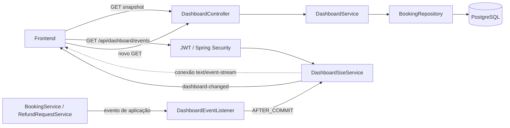
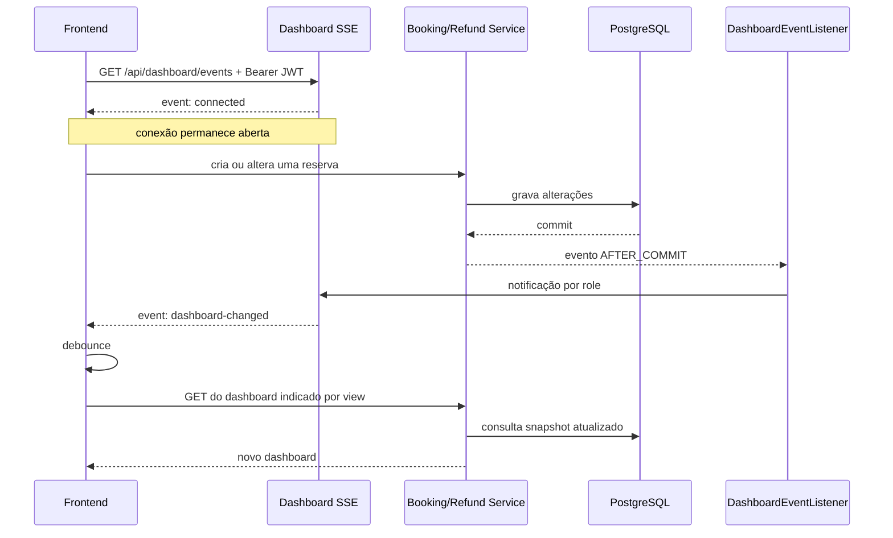
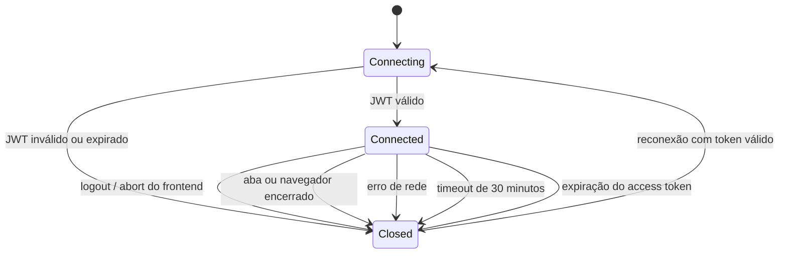
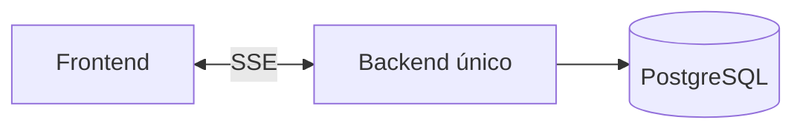
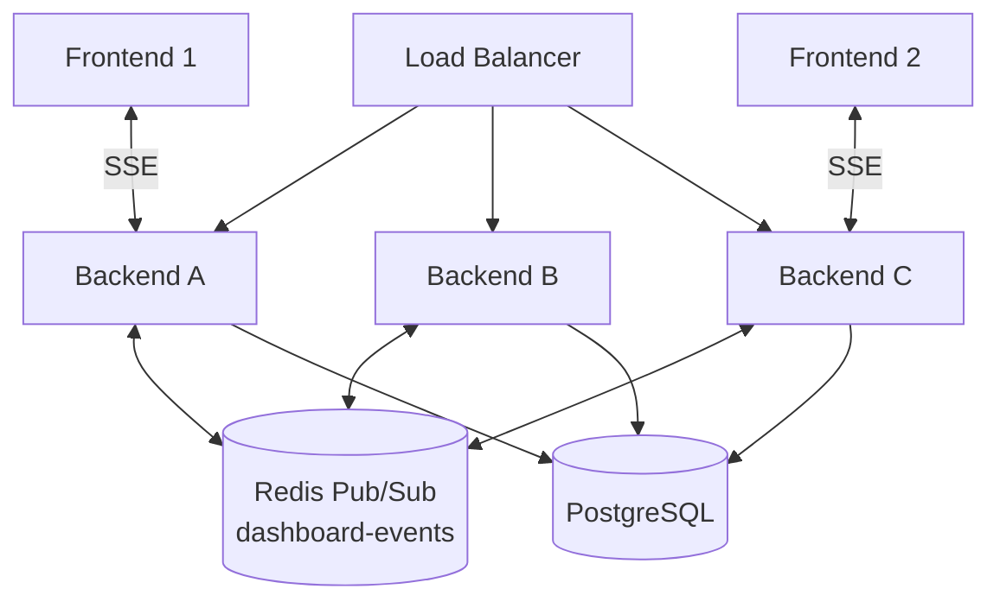

# Dashboard — arquitetura REST e Server-Sent Events

## Objetivo

O domínio de dashboard entrega snapshots de indicadores operacionais e financeiros por HTTP e usa Server-Sent Events (SSE) para avisar o frontend quando esses snapshots precisam ser consultados novamente.

O SSE não transporta o dashboard completo. O frontend mantém o último snapshot em memória e, ao receber `dashboard-changed`, executa novamente o GET correspondente. O PostgreSQL continua sendo a fonte oficial dos dados.

## Visão geral



## Endpoints

| Endpoint | Acesso | Responsabilidade |
| --- | --- | --- |
| `GET /api/dashboard` | `EMPLOYEE` | Snapshot do dashboard pessoal do funcionário autenticado |
| `GET /api/dashboard/finance` | `ADMIN` | Snapshot financeiro global |
| `GET /api/dashboard/events` | Usuário autenticado | Abre uma conexão SSE para receber invalidações |

Os snapshots aceitam `month=yyyy-MM` e `all=true`. O endpoint SSE não recebe esses filtros porque ele apenas informa que ocorreu uma alteração; o frontend já conhece os filtros atualmente selecionados.

## Componentes

### `DashboardController`

Expõe os endpoints REST e inicia a inscrição SSE. O usuário, o role e a expiração do access token são obtidos do `AuthenticatedUser`, criado após a validação do JWT.

### `DashboardService`

Monta os DTOs consultando projeções do `BookingRepository`. Os dashboards não são armazenados no cache do backend: cada GET produz um snapshot atualizado, enquanto o frontend conserva o resultado em memória até precisar recarregá-lo.

### `DashboardSseService`

Mantém somente as conexões HTTP abertas em memória. A estrutura é separada por role, usuário e aba/dispositivo:

```text
UserRole
  └── userId
        └── Set<SseEmitter>
```

Um conjunto é necessário porque o mesmo usuário pode abrir mais de uma aba ou dispositivo. `ConcurrentHashMap` e conjuntos concorrentes protegem a estrutura quando requisições e notificações são processadas simultaneamente por threads diferentes.

O serviço também:

- envia o evento inicial `connected`;
- envia um `heartbeat` periódico para manter a conexão ativa e detectar clientes desconectados;
- envia notificações apenas às conexões do role solicitado;
- remove conexões concluídas, expiradas ou com erro;
- limita a conexão ao menor valor entre 30 minutos e o tempo restante do access token.

### `DashboardEventListener`

Converte eventos internos da aplicação em notificações SSE. Seus métodos usam:

```java
@TransactionalEventListener(phase = TransactionPhase.AFTER_COMMIT)
```

Assim, o frontend só é notificado depois que a alteração foi confirmada no banco. Em caso de rollback, nenhuma notificação é enviada.

### Eventos e enums

`BookingStatusChangedEvent` já representa criação e mudança de status da reserva. `DashboardChangedEvent` cobre atualizações que não mudam o status, como alterações de passeio, participantes, desconto, cliente ou agenda.

`DashboardChangeReason` define os motivos suportados:

- `BOOKING_CREATED`;
- `BOOKING_UPDATED`;
- `BOOKING_STATUS_CHANGED`.

`DashboardView` define qual snapshot o frontend deve recarregar:

- `USER` para funcionários;
- `FINANCE` para administradores.

## Fluxo de atualização



## Contrato SSE

Ao abrir a conexão, o servidor envia:

```text
event: connected
data: {"connectedAt":"2026-08-15T12:50:00Z","role":"EMPLOYEE"}
```

A cada 25 segundos, por padrão, o servidor envia:

```text
event: heartbeat
data: {"sentAt":"2026-08-15T12:50:25Z"}
```

O intervalo pode ser configurado em milissegundos por `app.dashboard.sse.heartbeat-interval`. O heartbeat não solicita um novo GET; ele apenas mantém o stream ativo e permite remover uma conexão quando a escrita falhar.

Após uma alteração relevante, um funcionário recebe:

```text
event: dashboard-changed
data: {"bookingId":42,"reason":"BOOKING_UPDATED","view":"USER","occurredAt":"2026-08-15T12:51:00Z"}
```

Um administrador recebe a mesma alteração direcionada à visão financeira:

```text
event: dashboard-changed
data: {"bookingId":42,"reason":"BOOKING_UPDATED","view":"FINANCE","occurredAt":"2026-08-15T12:51:00Z"}
```

Funcionários são notificados em conjunto porque o dashboard pessoal contém demanda global por passeio. Administradores recebem somente notificações da visão financeira. Essa estratégia pode ser refinada caso as métricas pessoais deixem de depender de dados globais.

## Ciclo de vida e autenticação



O backend é stateless e não possui `HttpSession`. Por isso:

- no logout, o frontend deve abortar explicitamente o stream;
- ao destruir a tela ou serviço responsável, o frontend deve encerrar a conexão;
- ao fechar o navegador ou perder a rede, o backend remove o emitter quando o socket conclui, falha ou expira;
- na reconexão, o JWT passa novamente pelo filtro de segurança;
- após reconectar, o frontend deve refazer o GET, pois pode ter perdido uma notificação.

O `EventSource` nativo do navegador não permite definir o header `Authorization`. Mantendo autenticação Bearer, o frontend deve consumir o stream com `fetch` ou uma biblioteca SSE que aceite headers. O token não deve ser enviado em query string.

## Estado no frontend

O frontend deve:

1. carregar o snapshot inicial por GET;
2. mantê-lo no estado da aplicação;
3. abrir a conexão SSE autenticada;
4. aplicar um pequeno debounce às notificações;
5. recarregar apenas o endpoint indicado por `view`;
6. preservar o snapshot anterior enquanto o novo GET está em andamento;
7. abortar a conexão no logout;
8. reconectar e recarregar o snapshot após interrupções.

## Escalabilidade e Redis Pub/Sub

> **Decisão atual:** Redis não será usado para as notificações do dashboard. A implementação em memória atende à arquitetura de uma única instância e deve permanecer assim enquanto esse cenário não mudar.

Na arquitetura atual existe uma única instância do backend e os `SseEmitter` ficam em sua memória:



Redis só passa a ser necessário se o backend for executado com duas ou mais instâncias simultâneas. Nesse cenário, uma reserva pode ser alterada em uma instância diferente daquela que mantém a conexão do usuário. As instâncias não compartilham memória, portanto o evento local não alcançaria todos os clientes.

Se essa necessidade realmente surgir, Redis Pub/Sub poderá atuar como barramento de notificações:



Nesse modelo:

1. a instância que confirma a transação publica `DashboardChangedDTO` no canal Redis;
2. todas as instâncias assinam o canal;
3. cada instância repassa a mensagem somente aos seus emitters locais;
4. os emitters nunca são armazenados ou serializados no Redis.

Redis Pub/Sub não persiste mensagens. Isso é aceitável aqui porque o evento apenas invalida o snapshot: ao reconectar, o frontend executa um novo GET e recupera o estado atual. Redis Streams seria indicado somente se cada evento precisasse ser persistido, confirmado e reproduzido.

Enquanto houver uma única instância, o evento Spring local é suficiente. Não se deve implementar Redis Pub/Sub antecipadamente: sua adoção fica condicionada à decisão concreta de escalar o backend horizontalmente.
