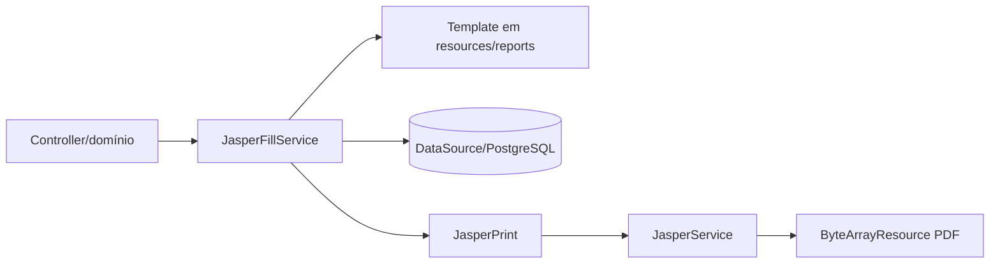

# Relatórios Jasper

O módulo transforma templates Jasper em recursos PDF para respostas HTTP.

## Fluxo

`JasperFillService.fillReport` abre o template compilado no classpath e uma conexão do `DataSource`, passa os parâmetros ao `JasperFillManager` e fecha ambos com try-with-resources. Template ausente ou erro de consulta é convertido em `JasperReportGenerationException`.

`JasperService.generatePdfResource` exporta o `JasperPrint` para um buffer em memória e devolve `ByteArrayResource`. Falhas de exportação viram `JasperPdfExportException`.

Os templates-fonte ficam em `src/main/resources/reports`. O módulo não contém regras financeiras próprias; valores e parâmetros devem ser definidos pelo domínio que solicita o relatório.
