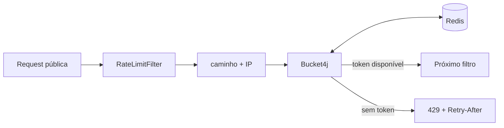

# Rate limiting

O módulo protege endpoints públicos sensíveis contra abuso e tentativas automatizadas. O filtro roda antes da autenticação JWT.

## Limites atuais

| Endpoint | Capacidade | Recarga | Chave |
| --- | ---: | --- | --- |
| `/auth/signin` | 5 | 5 tokens a cada 5 minutos | caminho + IP |
| `/auth/refresh` | 20 | 20 tokens a cada 5 minutos | caminho + IP |
| `/auth/forgot-password` | 3 | 3 tokens a cada 15 minutos | caminho + IP |

Rotas não listadas passam sem consumir bucket neste filtro.

## Componentes

`RateLimitFilter` escolhe a regra pelo caminho, usa `request.getRemoteAddr()` como IP e pede o consumo de um token. Ao exceder, responde HTTP 429 em JSON, inclui um identificador do erro e o header `Retry-After`. O tempo é arredondado para cima para não orientar uma nova tentativa antes da recarga real.

`RateLimiterService` usa Bucket4j com proxy Lettuce. Os buckets ficam no Redis, mantendo o mesmo contador entre várias instâncias do backend. Chaves ociosas expiram quando já haveria tempo suficiente para reabastecer o bucket, evitando crescimento permanente.

Em produção atrás de proxy/load balancer, a resolução de IP precisa ser configurada com cuidado; confiar indiscriminadamente em headers enviados pelo cliente permitiria contornar os limites.
