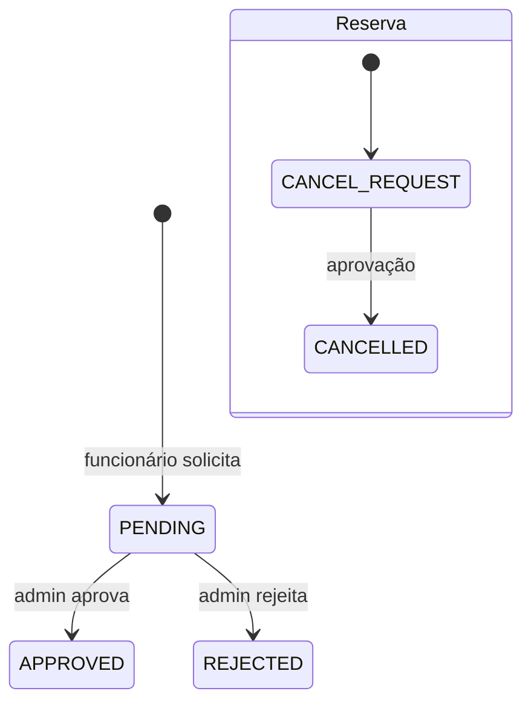

# Solicitações de reembolso e cancelamento

O domínio implementa um fluxo de revisão entre funcionário e administrador.

## Criação

`RefundRequestService.create` exige que:

- o solicitante não seja administrador;
- a reserva pertença ao solicitante;
- a reserva não esteja `CANCELLED` nem `CANCEL_REQUEST`;
- não exista outra solicitação `PENDING` para a reserva.

Após criar a solicitação, muda a reserva para `CANCEL_REQUEST` e publica o evento de histórico.

## Decisão

`resolve` aceita somente um usuário com papel `ADMIN` e rejeita resolução com status `PENDING` ou de uma solicitação já decidida. `RefundRequest.resolve` registra status, observação, administrador e horário.

- aprovação: reserva passa para `CANCELLED`;
- rejeição: a solicitação vira `REJECTED`, mas a reserva **permanece em `CANCEL_REQUEST`** no comportamento atual.

Essa permanência após rejeição é uma decisão existente no código e deve ser considerada caso o fluxo seja evoluído.

## Consultas

Administradores consultam o histórico global; funcionários consultam suas solicitações e opções de reservas próprias ainda elegíveis. Escritas invalidam caches de reserva porque o status associado muda.

